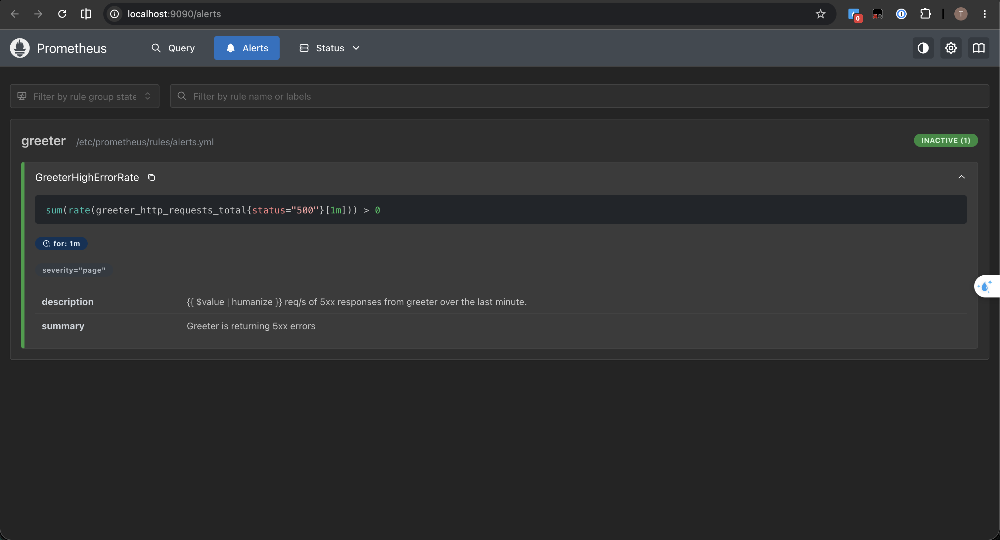
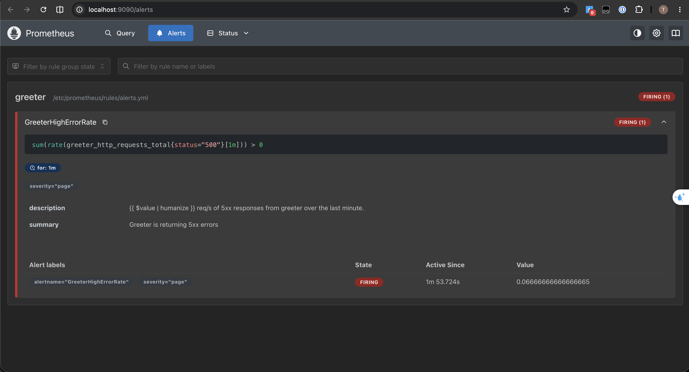
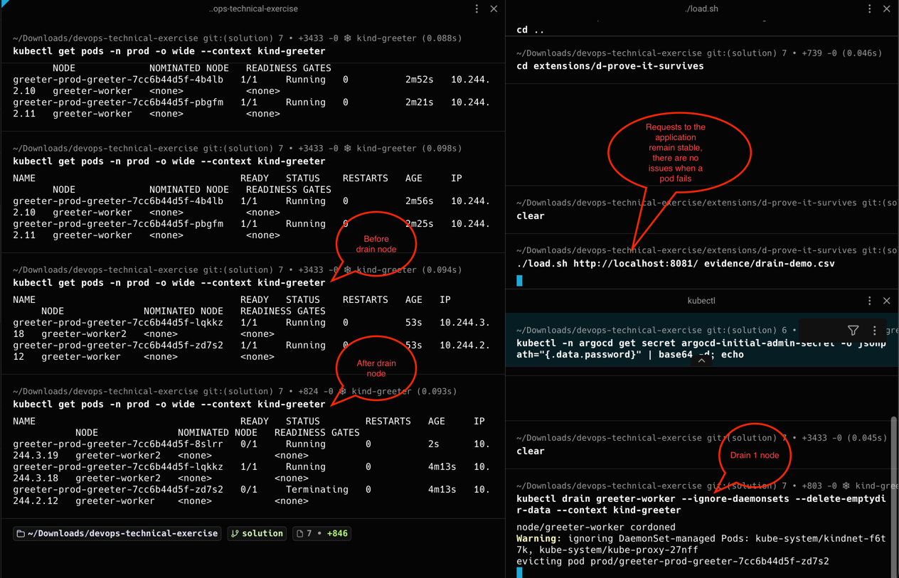
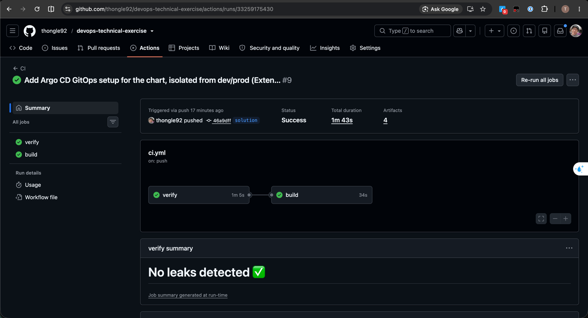
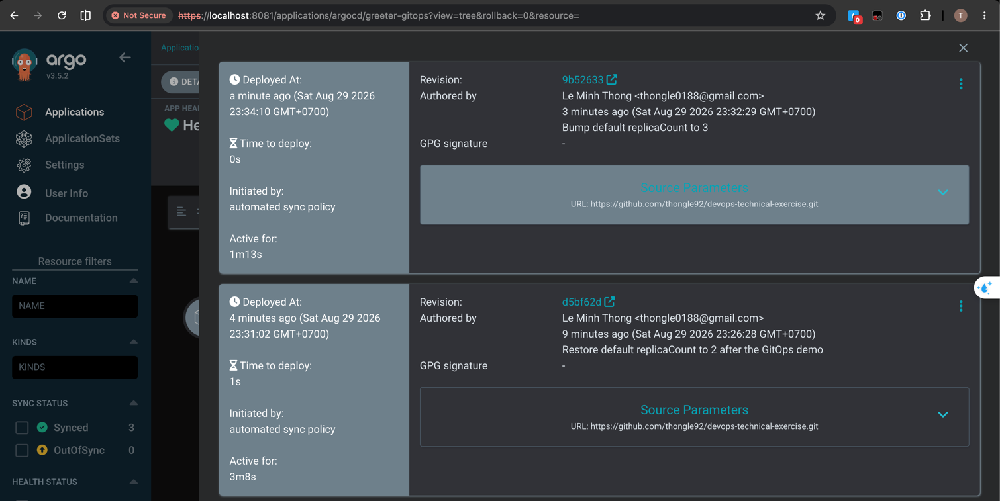

# Decisions

Covers Tasks 1–4 (container image, kind cluster, Helm chart, Terraform). Extension
work will be appended here as it's completed.

## Extension order and why

**B (Observability) → D (Prove it survives) → A (CI) → C (GitOps).**
Observability first because it's the cheapest way to get real signal (the
readiness gauge, the latency histogram) to look at while doing D. D second
because it directly validates the hardest requirement in the core tasks
(probes + PDB + node loss) while the chart is still fresh. A third: it's
mechanical and has no dependency on the others. C last: highest risk of
turning into a repository-auth time sink, and the brief explicitly allows
stopping and documenting intent instead of fighting it.

## Extension B — Observability

Metric chosen for the alert: `greeter_http_requests_total{status="500"}`,
not `greeter_ready` or the latency histogram. This wasn't a preference — it's
the only metric `/boom` actually moves. `/boom` returns 500 immediately
(`server.go:162-166`) without touching readiness and without sleeping, so an
alert on `greeter_ready` or on latency could never be demonstrated firing via
`/boom` as the brief asks.

Rule:
```
sum(rate(greeter_http_requests_total{status="500"}[1m])) > 0
for: 1m
```
This is an absolute-rate alert, not an error-*ratio* alert
(`5xx / total requests`), which is what I'd normally reach for first
(Google SRE book's "Alerting on SLOs" chapter argues for ratio/burn-rate
alerts to avoid noise). I didn't use a ratio here because all traffic in this
exercise is traffic I generate by hand to demo the alert — dividing by a
near-zero total request count would make the ratio unstable rather than more
meaningful. Absolute rate is the more honest choice for this low, controlled
traffic volume. In production, with real background traffic, I'd switch to
an error-ratio or multi-window burn-rate alert instead.

Prometheus itself is deployed as plain manifests (`extensions/b-observability/`), not
folded into the `greeter` Helm chart — it's a shared platform tool being
stood up once, not part of "packaging the service" (Task 3), and the brief
says a minimal Prometheus is fine. Evidence of the alert actually firing
(after ~90s of hitting `/boom`) is saved in `extensions/b-observability/evidence/`.

Before (`inactive`) and after (`firing`) in the Prometheus UI:




## Extension D — Prove it survives

Tested against **`prod`**, not `dev`. `dev` has `replicaCount: 1`, so
draining its node would trivially cause an outage — that would prove
nothing about the actual requirement. `prod` has 2 replicas spread across
both worker nodes plus the `PodDisruptionBudget`, which is the configuration
Task 3 actually claims survives node loss, so it's the only fair thing to
test against.

Results (`extensions/d-prove-it-survives/README.md`, raw CSVs in `extensions/d-prove-it-survives/evidence/`): node drain — 433
requests, 0 failures, max latency 10ms. Rolling update — 464 requests, 0
failures, max latency 6ms. Zero downtime in both cases, from three pieces
working together: the readiness probe (`periodSeconds: 2,
failureThreshold: 1`) flips fast enough that Kubernetes stops routing to a
terminating Pod inside the app's `SHUTDOWN_DELAY_SECONDS` window, the PDB
stops a voluntary disruption from ever taking the last replica, and
`terminationGracePeriodSeconds` is generous enough that the app's own drain
logic always finishes before Kubernetes would force-kill it.

One thing this surfaced that I want to flag rather than bury: after both
tests, the two replicas ended up on the *same* node, not spread one-per-node.
`podAntiAffinity` here is `preferred`, not `required` — it steers scheduling
decisions among nodes that are available *at that moment*, it doesn't
rebalance already-running Pods afterward. During both tests only one worker
was schedulable at a time, so both replicas landed there and stayed there.
Availability wasn't affected, but the cluster is left in a temporarily
weaker state (one bad node away from a real outage) until some later event
respreads them. I chose `preferred` over `required` specifically so
scheduling never fails outright on a small cluster — the trade-off is that
nothing proactively fixes this after the fact. A descheduler
(`descheduler-for-kubernetes`) would be the production answer; out of scope
here.

Annotated terminal capture of the drain — pod placement before/after and the
load script showing zero impact to the running application:



## Extension A — CI pipeline

**Scope assumption:** "the service" means the Go application, not the Helm
chart or Terraform in this repo — so this pipeline only builds/tests/scans
the app and its image (`.github/workflows/ci.yml`). It does not run
`helm lint` or `terraform validate`; those are a different concern from
"CI for this service" under this reading.

The pipeline reflects what I'd actually want for a Go service's CI in
production: secret scanning (gitleaks), lint (golangci-lint), SAST (Semgrep),
static analysis (SonarQube), dependency/image CVE scanning (Trivy), SBOM
generation, pushing scan results to DefectDojo and Dependency-Track for
vulnerability management, then building, scanning, signing (Cosign), and
pushing the image.

**What would actually run successfully as-is**, on a real GitHub repo, with
zero extra accounts or spend: `go test`, `golangci-lint`, `gitleaks`,
`semgrep scan --config=auto` (public ruleset, no account/token required),
Trivy's filesystem and image scans, SBOM generation, the Docker build, the
push to `ghcr.io` (works with the repo's own `GITHUB_TOKEN`, no external
registry needed), and Cosign keyless signing (uses GitHub's OIDC token
against the public Sigstore infrastructure — no private key to manage or
pay for).

**What needs infrastructure this exercise doesn't have**: the SonarQube step
(needs a `SONAR_HOST_URL` — either a self-hosted server or a SonarCloud
account) and the two steps pushing results into DefectDojo and
Dependency-Track (both need a running instance and an API key). Rather than
let those fail the whole workflow on a fresh clone/fork, each is gated on
its own secret being set. `if:` conditions can't reference `secrets.*`
directly — GitHub Actions rejects that at parse time
("Unrecognized named-value: 'secrets'") — so the job mirrors each secret's
presence into `env` first and the step's `if:` checks `env.*` instead. They
skip cleanly instead
of failing, so the pipeline as committed still runs green end-to-end. They're
included to show the intended pipeline shape, consistent with the brief's
"no cloud account, no credentials, no spend": the shape is real, the servers
aren't. Semgrep runs as `semgrep scan --config=auto` rather than `semgrep
ci` for the same reason — the latter expects a Semgrep account/token, the
former runs standalone against the public ruleset.

Running this for real (pushed to a public GitHub repo) surfaced an actual
tension: `golangci-lint` fails on real `errcheck` findings in the *provided*
app code (`server.go` — several unchecked `fmt.Fprint*` return values). The
brief says not to modify the app. I didn't disable the linter or the
specific check to force green — that would hide a real finding. Instead the
step runs with `continue-on-error: true`: it still executes, still reports
the finding in the logs/annotations for anyone looking, but doesn't block
the rest of the pipeline. If this were my code, I'd fix the unchecked errors
directly rather than reach for `continue-on-error`.

Docker layer caching uses the GitHub Actions cache backend
(`cache-from`/`cache-to: type=gha`, via `docker/setup-buildx-action`) rather
than a registry-based cache — no extra registry storage to manage, and it's
the backend Docker's own docs recommend by default for single-runner CI like
this. The `build` job builds the image twice (once to scan with Trivy before
anything is pushed, once to actually push) — the cache means the second
build reuses the first build's layers instead of rebuilding from scratch,
and every run after this one reuses the previous run's cache instead of
starting cold.

I confirmed all of the above by actually pushing to a public GitHub repo and
watching real runs (`gh run watch`) rather than assuming the YAML was
correct from local syntax validation alone - `yq`/local YAML linting caught
zero of the issues above, since they're all GitHub Actions schema/semantic
errors (invalid trigger shape, `secrets` in `if:`, a bad scan path), not
YAML syntax errors.

Action versions are pinned to specific releases rather than a floating tag
like `@master`. Concretely relevant here: `trivy-action` had a supply chain
compromise in March 2026 — pinning to a specific version (and, better, a
commit SHA in real production use) is exactly the practice that mitigates
that class of incident.

GitHub Actions run, both jobs green, gitleaks summary visible:



## Extension C — GitOps (Argo CD)

**Deliberately not pointed at `dev`/`prod`.** Those are already owned by
Terraform (Task 4). Having Argo CD reconcile the same releases would put two
controllers in charge of the same resources — Terraform enforcing `.tf`
state, Argo CD enforcing Git state — fighting each other on every
sync/apply. Argo CD instead manages its own release in its own `gitops`
namespace, satisfying "a commit changes the cluster" without an ownership
conflict. Details and evidence in `extensions/c-gitops/README.md`.

The repository authentication risk the brief calls out didn't materialize,
because the repo is public — Argo CD pulls over plain HTTPS, no deploy key
or PAT needed. What actually cost time instead were two real bugs only
visible once this ran for real: the chart's `Service` template
unconditionally set `nodePort`, which collided with `dev`'s NodePort
(cluster-scoped, not namespaced) the moment Argo CD tried to create its own
Service — fixed by making `nodePort` conditional on `service.type ==
"NodePort"` in the chart itself, a genuine, previously-undiscovered gap in
the chart's support for `ClusterIP`. Second, Argo CD kept retrying against a
stale rendered manifest after a parameter change even after a hard-refresh
annotation; deleting and recreating the `Application` cleared it. I didn't
fully root-cause the second one and I'm saying so rather than implying I
did.

Proved the actual requirement — a commit changing the cluster with zero
`kubectl` involved — by bumping the chart's default `replicaCount` (2→3)
and pushing; `dev`/`prod` are unaffected since Terraform always passes
`replica_count` explicitly regardless of the chart's default. Argo CD picked
up the commit on its own poll interval and scaled to 3 replicas
unattended (`selfHeal` + `automated` sync). Evidence in
`extensions/c-gitops/evidence/`.

Argo CD's own history view, tying each auto-sync to the actual commit and
author that triggered it:



## Decisions I'm least sure about

**NodePort instead of an Ingress controller.** Reachability is satisfied with a
`NodePort` Service plus kind's `extraPortMappings`, mapping each environment to
its own host port (`8080` for dev, `8081` for prod). It's the simplest thing
that satisfies "reachable from outside the cluster" for a single-laptop kind
cluster, but it comes with a real cost: the NodePort has to be kept in sync by
hand across three places — `cluster/kind-config.yaml`, the chart's
`values.yaml` default, and each Terraform environment's override. This exact
mismatch caused a real bug during development (two environments tried to claim
the same NodePort). An Ingress controller (ingress-nginx) would remove the
per-environment port bookkeeping entirely and is the first thing I'd change if
this needed to look more production-like. I'd change my mind on this quickly
if asked to support host-based routing or TLS.

**Deriving the environment name (`dev`/`prod`) in Terraform from the
directory.** I initially tried `basename(path.root)`, found it resolves to
`"."` when Terraform is run the normal way (`cd` into the directory, then
`plan`/`apply`). Switched to `basename(path.cwd)`, which fixes that case but
silently breaks the opposite way if someone runs Terraform via
`-chdir=terraform/greeter/dev` from elsewhere — it would resolve to whatever
directory the shell was actually in. I kept `path.cwd` (documented the
constraint in a comment) rather than reverting to a literal string, trading a
small amount of safety for less duplication between `dev/main.tf` and
`prod/main.tf`. Given the README's own warning that they will "actually try to
run" this on a different machine, a plain literal `"dev"` / `"prod"` in each
file is probably the more defensible choice, and I'd switch to that if this
went any further than a take-home exercise.

**Readiness probe tuned to `periodSeconds: 2, failureThreshold: 1`.** This is
deliberately aggressive so Kubernetes notices a Pod turned unready well inside
the app's own `SHUTDOWN_DELAY_SECONDS` (10s default) window. The trade-off:
`failureThreshold: 1` means a single slow or transiently-failed health check
under real load could flip a healthy Pod to NotReady. I haven't load-tested
this combination — Extension D's drain/rollout evidence is the closest thing
to real validation it gets in this exercise.

## What I considered and rejected

- **Kustomize instead of Helm.** Both were allowed. Chose Helm because the
  dev/prod difference (Task 4) maps directly onto `values.yaml` + `--set`,
  and the Terraform `helm` provider integration is more direct than the
  Terraform `kubernetes` provider consuming `kustomize build` output.
- **A `startupProbe`.** Rejected outright: the README states liveness
  (`/healthz`) passes throughout warmup, so there is no slow-start-vs-liveness
  race for a `startupProbe` to protect against here. Adding one would be
  configuration with no failure mode it actually prevents.
- **Generic `secretRef`/`configMapRef`/`extraEnvs` extensibility in the
  chart.** The service has exactly six fixed, known environment variables and
  no secrets or ConfigMaps. Adding that extensibility layer would be
  boilerplate with nothing to justify it — directly against the brief's "a
  minimal set of resources you can justify line by line."
- **Folding `GREETING_NAME` into the generic `env` list** (alongside `PORT`,
  `VERSION`, etc., rendered via `range`). Rejected because Terraform would
  then have to target it by list index (`env[0].value`) rather than by name,
  which silently breaks if the list is ever reordered. Kept it as its own
  top-level value instead, since it's the one value Terraform genuinely needs
  to override per environment.
- **`kind`/`k3d`/`minikube`** — went with `kind`: most common for local
  multi-node clusters, config is a single declarative YAML file, integrates
  directly with the Docker image already being built.

## Ambiguities and assumptions

- The README doesn't specify exact probe timings — only the shutdown/warmup
  *contract* (env vars and their meaning). I derived
  `terminationGracePeriodSeconds` and the readiness probe's polling interval
  from that contract myself: `shutdownDelaySeconds + drainTimeoutSeconds +
  15s margin`.
- "Reachable from outside the cluster... how is up to you, as long as you
  document it" — took this as license to use the simplest local mechanism
  (NodePort) rather than installing an Ingress controller.
- "Two environments... without duplicating the whole configuration" — assumed
  this means a shared Terraform module with per-environment call sites, not
  necessarily separate remote state or separate clusters. Both environments
  currently run in the same kind cluster, isolated by namespace
  (`dev`/`prod`), which lets them run side by side for demonstration.
- No versioning scheme was specified for the image tag. Chose semver
  (`1.0.0`) tied to the app's own `VERSION` env var/label, so what `/version`
  reports always matches the image tag deployed.

## What I'd do differently for something production-facing

- **Separate clusters for dev and prod, not shared namespaces in one
  cluster.** What I built here (both environments in one kind cluster,
  isolated by namespace) is a local-exercise convenience, not something I'd
  defend in production. Reasons: blast radius (a control-plane incident, a
  misconfigured cluster-wide policy, or a bad CRD in dev should never be able
  to touch prod), different upgrade/maintenance cadences (you want to test a
  Kubernetes version bump in dev before prod ever sees it), different
  access-control and compliance boundaries (who can `kubectl exec` into prod
  should be a much smaller set of people than dev, and that's much harder to
  enforce cleanly with namespace-scoped RBAC alone), noisy-neighbor risk
  (a runaway dev workload consuming node resources shouldn't be able to
  degrade prod), and cost/usage attribution. If budget genuinely doesn't
  allow separate clusters, the middle ground is separate **node pools** per
  environment within one cluster — label and taint the prod node pool
  (e.g. `kubectl taint nodes <node> env=prod:NoSchedule`, with matching
  `tolerations`/`nodeSelector` on prod workloads) so dev Pods physically
  cannot schedule onto prod nodes, even though they still share a control
  plane.
- **A properly generic, reusable Helm chart, versioned with git tags,**
  instead of one chart hand-fitted to this single service. A real production
  environment has many services, not one — the chart built for this exercise
  is deliberately minimal and specific to `greeter`'s exact contract
  (probes, env vars, PDB), which is the right scope for this exercise but
  the wrong scope for an organization deploying many services. That calls
  for a shared, parameterized "application" chart (or a small family of
  charts for different workload shapes) published and versioned like any
  other dependency, so services consume a known-good version rather than
  copy-pasting chart YAML.
- **Additional platform components** most real production Kubernetes
  environments need for security, compliance, and availability that this
  exercise deliberately has none of: a service mesh such as **Istio** (mTLS
  between services, traffic shaping, observability at the network layer),
  **Karpenter** for node-level autoscaling driven by actual scheduling
  pressure, **KEDA** for event-driven/metric-driven autoscaling beyond plain
  CPU/memory, and **Kyverno** (or OPA/Gatekeeper) to enforce policy — e.g.
  "no Deployment without resource limits," "no container running as root" —
  automatically instead of by code review.
- **Remote Terraform state with native S3 locking** (`use_lockfile = true`
  on the S3 backend, Terraform ≥ 1.9, GA since v1.11.0) instead of a local
  state file per environment — right now two people applying at once would
  corrupt state. [Verified against HashiCorp's S3 backend docs, 2026-08-29:
  DynamoDB-based locking is deprecated now that S3 supports native locking
  via conditional writes, so a separate DynamoDB table is no longer needed.]
- **A real container registry** instead of `kind load docker-image` — this
  only works because everything is on one laptop.
- **An Ingress controller with TLS** instead of NodePort, as above.
- **CI-driven image tags** (git SHA or a release process) instead of a
  hand-bumped semver string.
- **Load-test the readiness probe timing** before trusting
  `failureThreshold: 1` in front of real traffic.
- **NetworkPolicies** and tighter RBAC — currently the default ServiceAccount
  and no network restrictions are in play, acceptable only because this is a
  single, self-contained service.

## What I deliberately left out, and why

- **HorizontalPodAutoscaler / autoscaling** — no load pattern in this
  exercise to autoscale against; fixed `replicaCount` per environment is
  sufficient and honest about what's actually being tested.
- **Ingress controller** — see above; NodePort satisfies the stated
  requirement with far less to install and maintain locally.
- **Custom ServiceAccount / RBAC** — the app never talks to the Kubernetes
  API, so the default ServiceAccount is correct, not an oversight.
- **ConfigMap/Secret resources** — all configuration is small, non-sensitive,
  and fits inline as Helm values; adding a ConfigMap would be indirection
  with no benefit.
- **NetworkPolicy** — single service, no east-west traffic in this exercise
  to restrict.
- **Remote Terraform backend** — this is a single-laptop exercise; a local
  backend is the simplest thing that's still correct for that scope.
